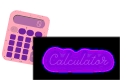

> # 
 React Calculator 

In my first React project, I chose to develop the calculator for specific reasons: **Scope, Simplicity, Interesting Points, Challenge**

### My reasons:

* **Scope**: The targeting may be simple, but it has a lot of future scope. This project will offer you to study and create an enhanced version could be targeted towards a specific field such as developing a scientific calculator. 

* **Simplicity**: It is a simple gadget and with  many varieties of styles and you will can calculator that will be able to do all the basic arithmetic operations such as addition, subtraction, multiplication, and division. 

* **Interesting Points**: I did need to identify and create all the different components, identify and establish a mutual interactive platform and I had to handle  with crashes, and bugs.

* **Challenge**: Development the Ux design, with has several buttons to accommodate and while designing you will also have to take care of the readability and overall User Experience.

>## 
 Screenshot 

*Hello Calculator*

